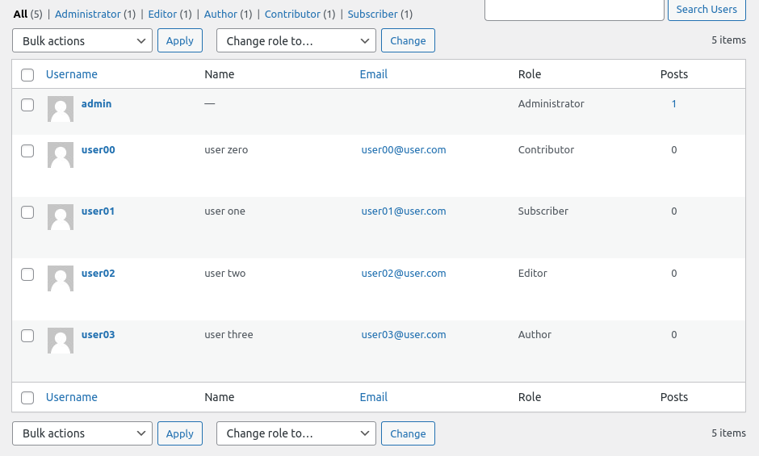

# LAB FOUR

## PART A

> #### ONE

The wordpress theme and plugins installed allow for a number of different user roles to be applied to any user. Each role gives specific access and permissions to different aspects of the wordpress project. 

- SEO editor

- SEO manager

- subscriber

- contributor

- author

- editor

- administrator

> #### TWO, THREE, FOUR, FIVE, SIX

Implementing users is done via the 'Users' section of the dashboard. Each user is required to provide some basic information about themselves, and their role can be initialised during this process. A users role can also be modified after their creation via the same 'Users' section. 

## PART B

> #### ONE

There are a few common deployment types for wordpress projects, some popular options include Heroku, Netlify, AWS, or other popular hosting services like Digital Ocean, which will be used as the deployment example for this project.

I followed [this tutorial](https://www.digitalocean.com/community/tutorials/how-to-use-the-wordpress-one-click-install-on-digitalocean-2) for my deployment example.

> 1. Create a Wordpress Droplet on Digital Ocean

> 2. Select and configure image used by droplet (WordPress 5.5.1 on Ubuntu 20.04)

> 3. Check placeholder page by entering the droplets IP address into a web browser

> 4. Access via SSH and configure domain

> 5. configure logins and passwords

For this step, all thats needed is to configure the MySQL db and wordpress passwords so that the droplet deployment can access them.