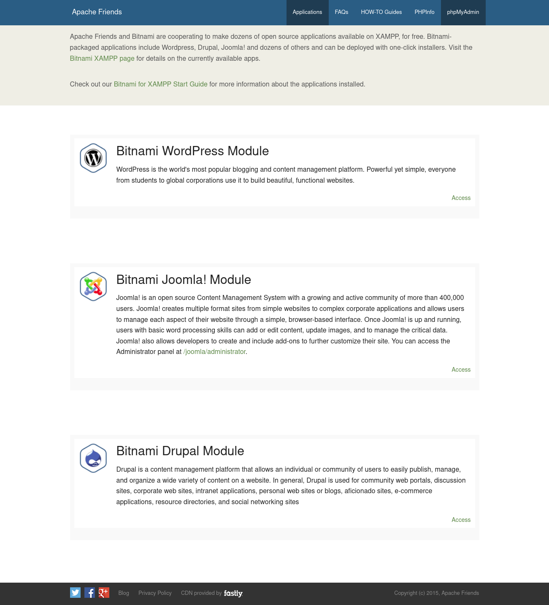
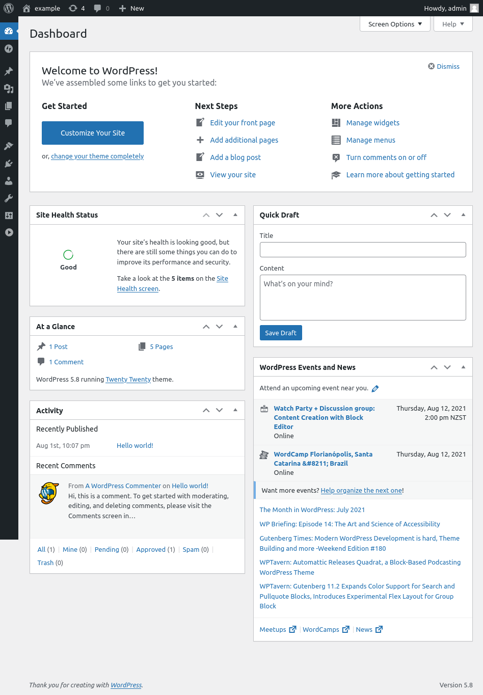
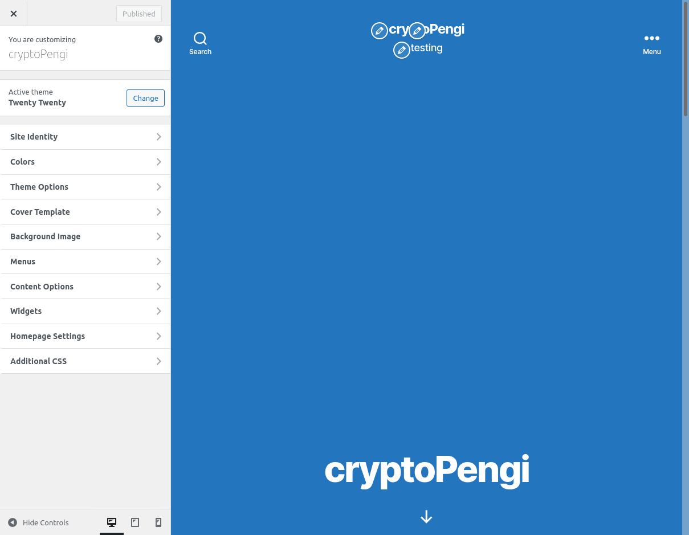
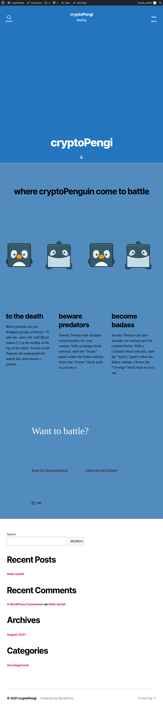
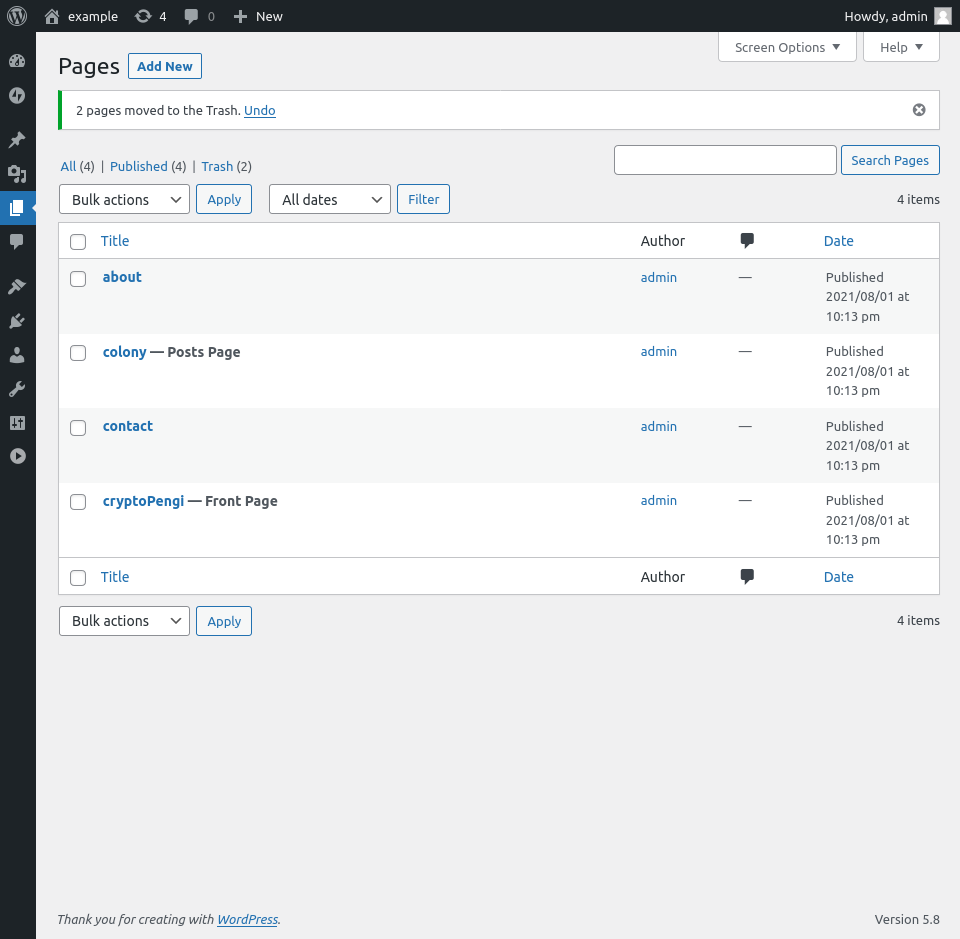
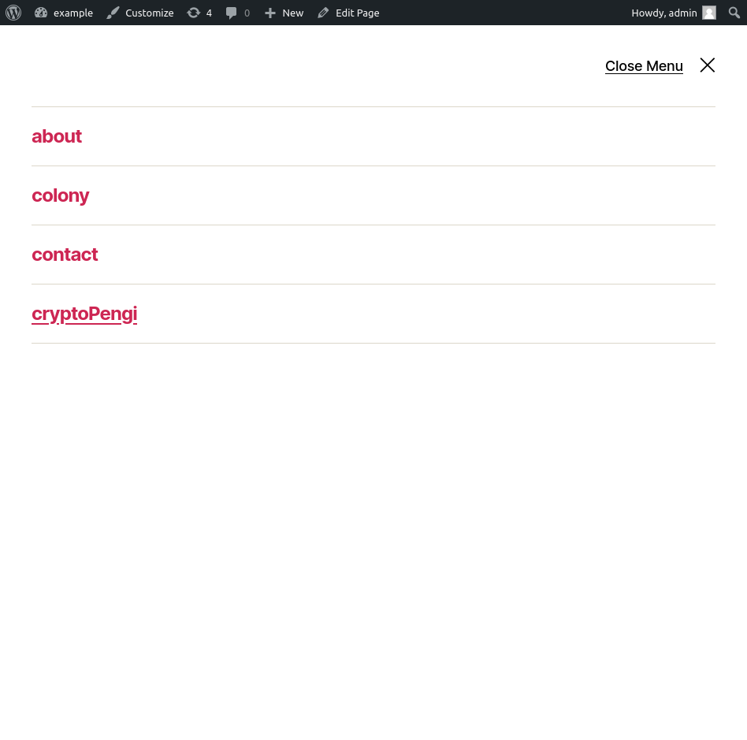
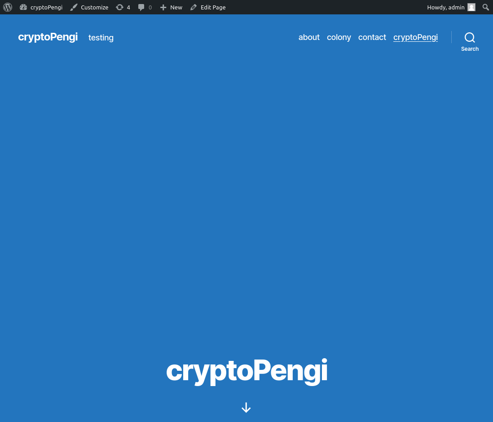

# LAB ONE

## PART A

> ### ONE : NODEJS && XAMPP

Nodejs and XAMPP are used for very different purposes and it is diffuclt to compare the two.

XAMPP is a software distribution package that provides a full stack web server solution. The actual web server is the Apache HTTP Server, so it would be more practical to compare Node with Apache.

Nodejs is a javascript runtime environment that allows developers to create web servers and run javascript outside of the web browser.

> ### TWO : 3 FRAMEWORKS INSTALLED

Worpress, Joomla, and Drupal have all successfully been installed. After starting XAMPP and navigating to ```http://localhost/applications.html``` the follwoing screen is displayed.



> ### THREE : COMPARISON TABLE

Not sure how to create a table that compares two very different things. The features and purposes of Nodejs and XAMPP are very different, a few parallels can be drawn between using Nodejs as a web server and aspects of XAMPP that handle web server functionality. 

> ### FOUR : INDUSTRY USAGE

Nodejs is most commonly used to run javascript code outside of a web browser. There are many different use cases for Nodejs, command line tools and web server functionality are among the most common. There are numerous Nodejs frameworks that provide focused functionality. An example of a very popular Nodejs framework used in web back-end development is Expressjs.

XAMPP is a distribution that provides a full-stack solution that revolves around the Apache HTTP Server as a web server. The XAMPP distrubtion includes Apache HTTP Server, MariaDB, PHP, and Perl. The distribution focuses on simplicity of installation, out-of-the-box cross-platform capability, and ease of use.

## PART B

> ### ONE : LOCAL && REMOTE 

XAMPP is installed and used for development on the developers local machine. Once a project is ready for production the code can be migrated to a remote source such as a cloud service or even directly from the GitHub repository.

> ### TWO :  ADMIN DASHBOARD



The Wordpress admin dashboard offers options and settings to control every aspect of a project. On the left hand side there is a side nav bar that contains most of the admin options, including: posts, media, pages, appearance, plugins, users, tools, and general settings. The main display of the admin dashboard has a general overview of the project and access to most commonly used features and options.

### THREE : THEME



After exploring a few themes, I have selected one of the three default themes supplied. I chose theme 'Twenty Twenty' because there was not too much additional work to be done using the theme. A few themes I tried prior had a large number of additional plugins and dependancies that needed to be installed and configured before the theme worked as desired.

A screenshot of the full landing page can be seen below.



### FOUR : PLACEHOLDER PAGES



I have created four placeholder pages for my project: a front page, about, posts and update page, and a contact page. Another page or two may be added later on in the project, or one of the current pages might be modified.

### FIVE : NAVIGATION



In the upper-right corner of any page, the navigation menu is accessible on narrow screens. The open navigation menu is displayed in the screenshot above. 



On wider screens the navigation bar and all pages are visible, as seen in the screenshot above.