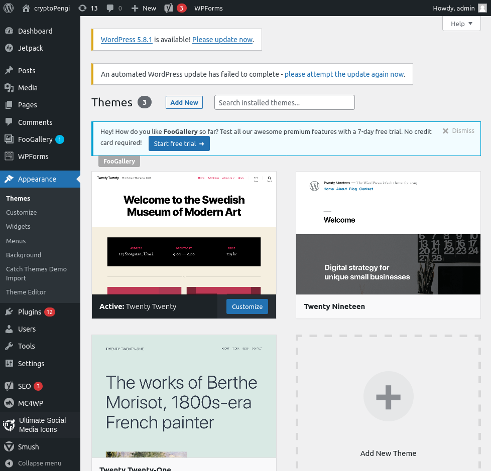
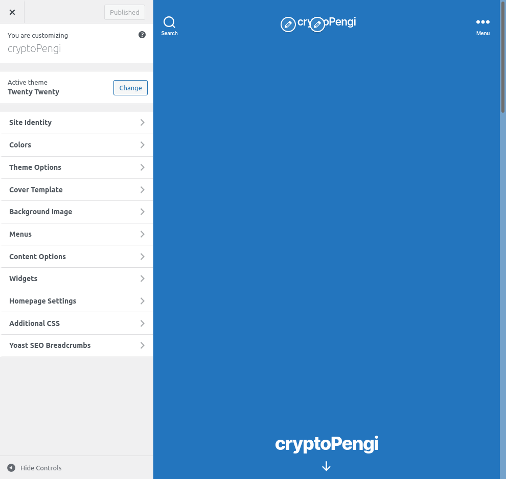

# LAB THREE

## PART ONE

Theme selection is pretty simple in wordpress. From the main dashboard navigate to the Appearance section, then to the 'themes' to implement and configure the theme used. 

Searching for possible themes is possible via categories or keyword searches. For this project, I decided to use one of the default themes provided. I explored using other themes, but consistently encountered themes that required paid features for their implementation. 

## PART TWO

For the theme implemented, the easiest way to access and customize aspects of the theme is via the 'Appearance' navigation menu. The theme implemented only allows customized CSS via the 'Customize' submenu. 

## PART THREE

The theme implemented does not allow for much HTML, CSS, and jQuery customization. The pages are broken into specific sections and characteristics of each section can be modified via a graphical user interface. 

