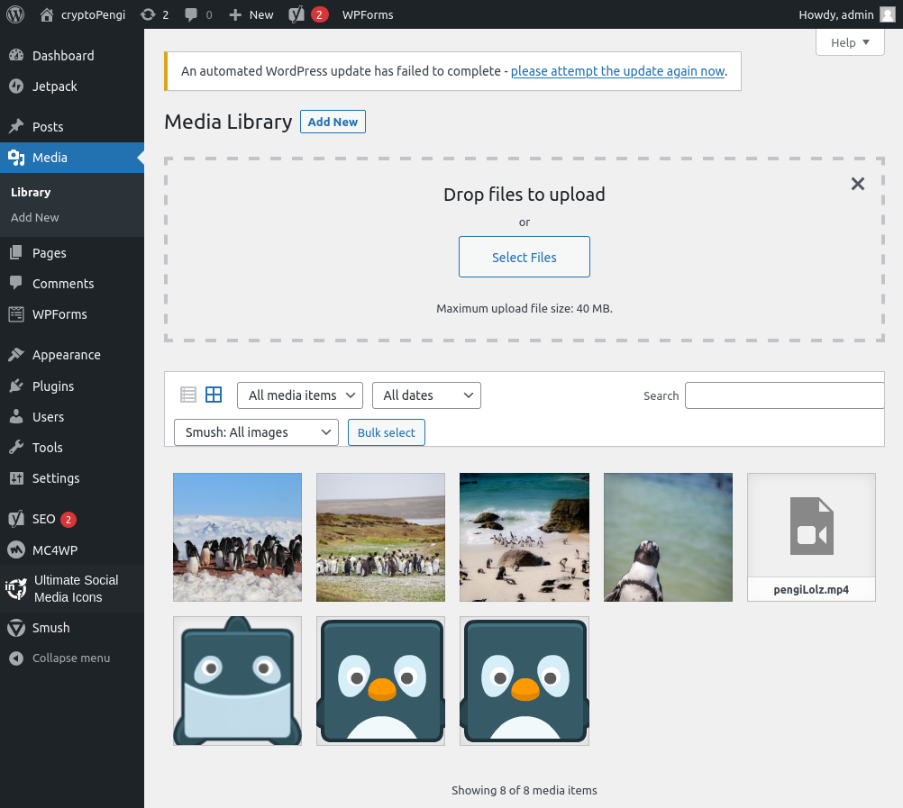
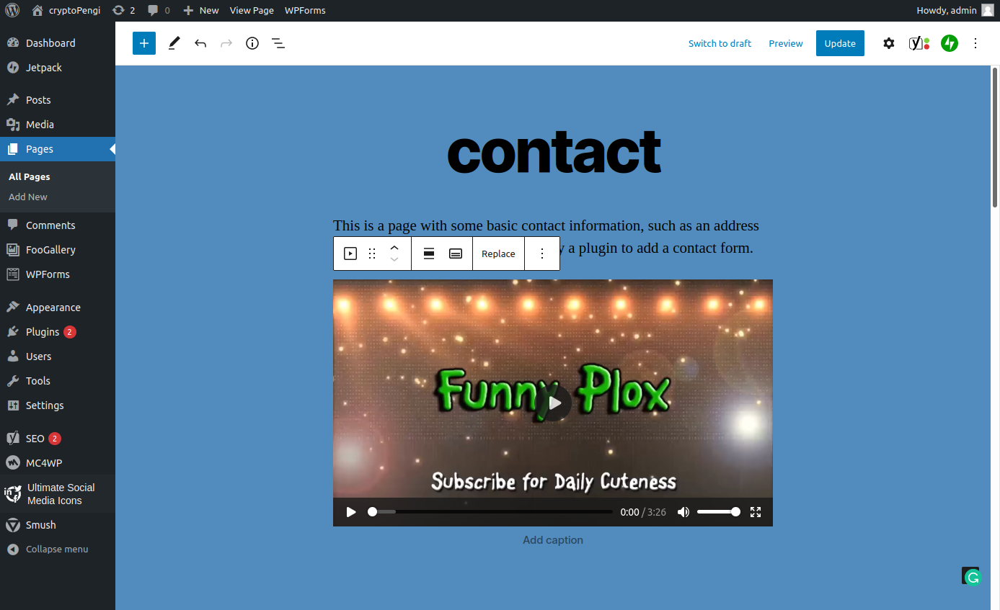
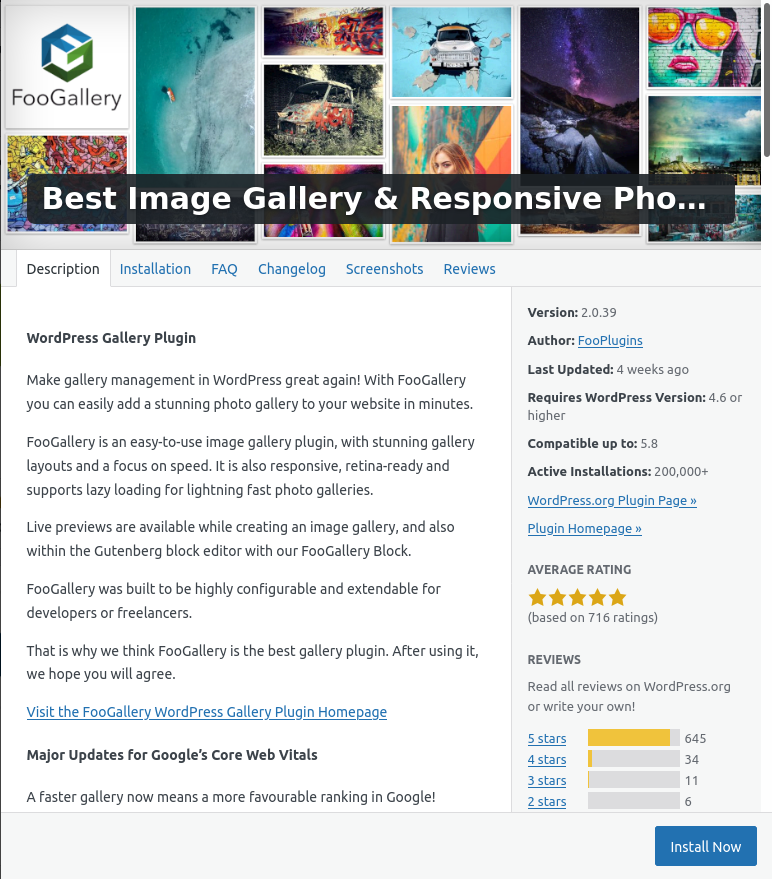

# LAB ONE

## PART A

> ### ONE : MEDIA MANAGEMENT

Media management is controlled via the admin dashboard. A section link can be found on the left hand navigation bar. There are also additional menus available on the left hand side for some media related plugins that may be installed.

> ### TWO : ADDING MEDIA

Media managment is straight forward and simple. Files maybe be selected via a file explorer window or by dragging and dropping directly on the designated uplaod area. For the example, I have uploaded four medium sized images and a single video with audio. The entire upload took a few seconds.

I added the video previously uploaded to the contact page, it can be seen below.

> ### THREE : GALLERY IMPLEMENTATION 

I have used a media plugin called [FooGallery](https://fooplugins.com/foogallery/?utm_source=wp_plugin&utm_medium=foogallery_free&utm_campaign=help) to create a media gallery for my site. The implementation was simple and easy thanks to the GUI and excellent documentation.

There were some issues creating a custom gallery without having a paid version of FooGallery, so demo galleries will be used. The following steps were followed to add a gallery to one of the pages of my website:

> 1. navigate to the page via the pages link on the left hand nav bar.
> 2. toggle blue block insert menu (upper left hand corner) to open available blocks
> 3. select FooGallery from the MEDIA section
> 4. follow FooGallery block GUI and insert gallery, edit and preview as necessary

